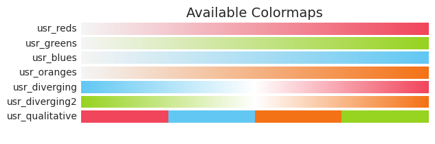
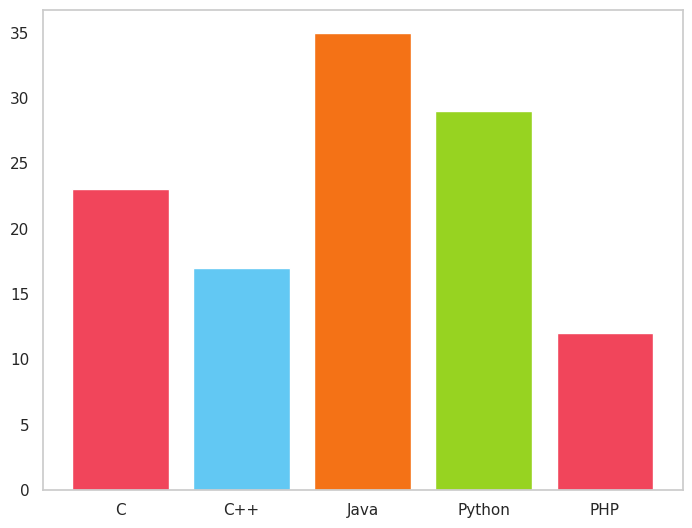
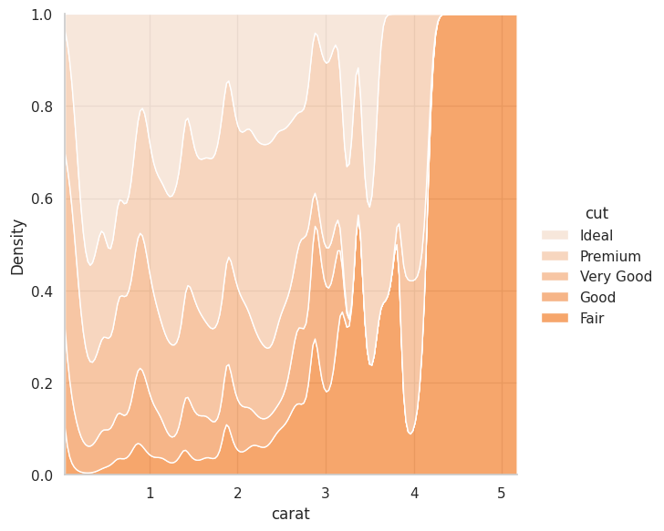

# USRL Colormaps

This repository contains a collection of colormaps that are useful when generating figures for
presentations or papers by the Uppsala Social Robotics Lab. Available colormaps:



## Installation

```
pip install usrl-colormaps
```


## Usage

Inside of matplotlib:

```python
import matplotlib.pyplot as plt
import matplotlib.cm as cm
import usrl_colormaps  # colormaps are registered automatically

fig = plt.figure()
ax = fig.add_axes([0,0,1,1])
langs = ['C', 'C++', 'Java', 'Python', 'PHP']
students = [23,17,35,29,12]
ax.bar(langs,students, color=cm.get_cmap("usr_qualitative").colors)
ax.grid(False)
plt.show()

```



In seaborn:

```python
import seaborn as sns
import usrl_colormaps  # colormaps are registered automatically


sns.set_theme(style="whitegrid")
diamonds = sns.load_dataset("diamonds")

# Plot the distribution of clarity ratings, conditional on carat
sns.displot(
    data=diamonds,
    x="carat", hue="cut",
    kind="kde", height=6,
    multiple="fill", clip=(0, None),
    palette="usr_oranges",
)
```

